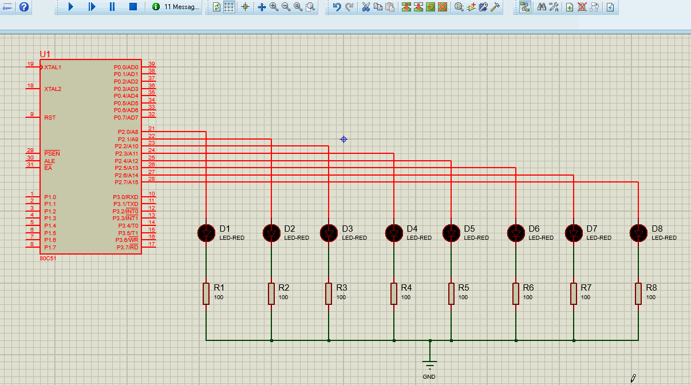

# 51simulation

用 proteus 对 8051 及其外设进行仿真


# 点亮流水灯 :traffic_light:

## 在 proteus 中添加器件并布线

首先，在 proteus 中建立一个空项目，然后添加我们需要的器件

点击右侧栏中的`P`按钮，搜索 :mag: `80C51`, 选择搜索结果第一个，点击`OK`返回工作区，在工作区按下鼠标左键即可添加这个器


然后如此添加红色发光二极管`led-red`、电阻`res`，双击电阻更改阻值为`100`（proteus 中 led 亮度并不是只有亮与不亮两种，而是与流过其的电流有关，改小电阻会使发光现象更明显），将 led 与电阻串联起来，复制得到总共 8 份，led 采用共阴极 :new_moon: 接法，阴极接到`ground` :earth_asia: 上，`ground`无法通过搜索得到而是要在左边栏 :point_left: 获取


阳极 :sunny: 依次接到单片机的 21~28 号引脚


这样，器件布局工作就完成了

## 用 keil 编译 c 并生成 hex 文件

在 keil 中新建项目，`select device`时选择`T80C51`，如果你没有51单片机的软件包，可以在[keil官网](https://www.keil.com/download/product/)选择c51进行下载，下载后直接安装再重启软件即可


项目建好后，新建一个文件，编写如下代码

```c
#include <reg51.h>

void delay500ms(void){
	unsigned char a,b,c;
	for(c=23;c>0;c--){
		for(b=152;b>0;b--){
			for(a=70;a>0;a--)
			{
			}
		}
	}
}


void main(){
	unsigned char count = 0;
	P2 = 0X01;
	while(1)
	{
		P2 = P2 << 1 ;
		if (P2 == 0x00){
			P2 = 0x01;
			}
		delay500ms();
	}
}
```

保存为`main.c`

在项目的`Source Group 1`上右击 -> `Add Existing Files...`然后选择项目目录下的`main.c`文件，这样我们就将这个文件纳入我们的项目之中了

接下来是编译前的最后一步，点击工具栏中长得像魔棒的这个按钮


先在`Target`栏将晶振调整为`12MHz`, 再到`Output`栏把`Creat HEX File`勾上


设置好，点击`ok`返回主页面，点击工具栏左侧的`Translate`和`Build`进行编译和构建，如果成功，可以看见信息栏输出信息，提示已创建 hex 文件


这样我们就得到了一个可以直接在单片机上运行的程序文件，接下来我们将它“烧录”到模拟单片机上

## 将 HEX 文件“烧录”到模拟单片机上

再次打开 proteus 界面，在单片机上双击，在器件编辑页面中挂载刚刚生成的 hex 文件，并确认时钟频率是 12MHz（之前在 keil 中设置的是何值，此处就应是何值）


最后，点击运行按钮，即可在计算机上 :computer: 直接模拟单片机程序的运行效果


